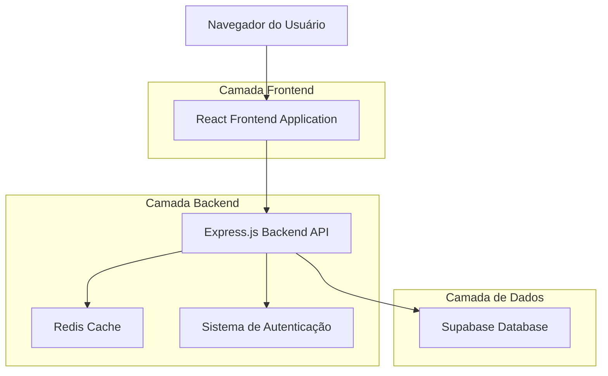
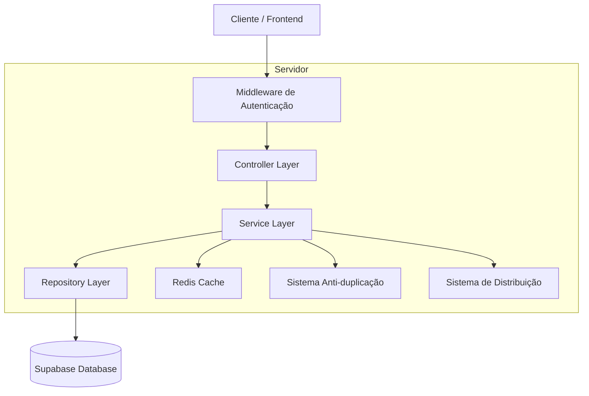
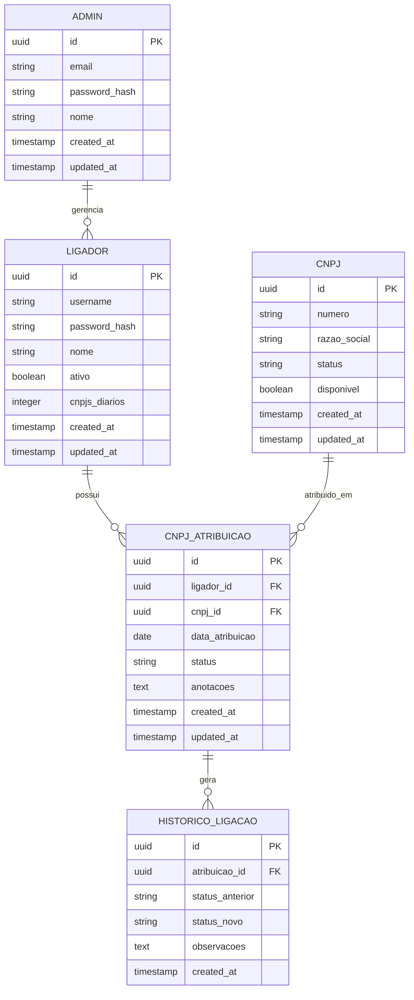

# Sistema BB PJ - Documento de Arquitetura Técnica

## 1. Design da Arquitetura



## 2. Descrição das Tecnologias

* Frontend: React\@18 + TypeScript + TailwindCSS\@3 + Vite + React Router

* Backend: Express.js\@4 + TypeScript + JWT Authentication

* Database: Supabase (PostgreSQL)

* Cache: Redis para sessões e distribuição de CNPJs

* Autenticação: JWT com refresh tokens

## 3. Definições de Rotas

| Rota                 | Propósito                                   |
| -------------------- | ------------------------------------------- |
| /admin/login         | Página de login para administradores        |
| /admin/dashboard     | Dashboard principal do administrador        |
| /admin/cnpjs         | Gestão de CNPJs - importação e visualização |
| /admin/ligadores     | Gestão de usuários ligadores                |
| /admin/relatorios    | Relatórios e estatísticas                   |
| /admin/configuracoes | Configurações do sistema                    |
| /ligador/login       | Página de login para ligadores              |
| /ligador/dashboard   | Dashboard do ligador com CNPJs atribuídos   |
| /ligador/historico   | Histórico de ligações do ligador            |

## 4. Definições de API

### 4.1 APIs Principais

**Autenticação de Administrador**

```
POST /api/admin/auth/login
```

Request:

| Nome do Parâmetro | Tipo   | Obrigatório | Descrição              |
| ----------------- | ------ | ----------- | ---------------------- |
| email             | string | true        | Email do administrador |
| password          | string | true        | Senha do administrador |

Response:

| Nome do Parâmetro | Tipo    | Descrição              |
| ----------------- | ------- | ---------------------- |
| success           | boolean | Status da autenticação |
| token             | string  | JWT token de acesso    |
| refreshToken      | string  | Token para renovação   |

**Autenticação de Ligador**

```
POST /api/ligador/auth/login
```

Request:

| Nome do Parâmetro | Tipo   | Obrigatório | Descrição                  |
| ----------------- | ------ | ----------- | -------------------------- |
| username          | string | true        | Nome de usuário do ligador |
| password          | string | true        | Senha do ligador           |

**Importação de CNPJs**

```
POST /api/admin/cnpjs/import
```

Request:

| Nome do Parâmetro | Tipo    | Obrigatório | Descrição                     |
| ----------------- | ------- | ----------- | ----------------------------- |
| file              | File    | true        | Arquivo CSV/Excel com CNPJs   |
| overwrite         | boolean | false       | Sobrescrever CNPJs existentes |

**Distribuição de CNPJs**

```
POST /api/admin/cnpjs/distribute
```

Request:

| Nome do Parâmetro | Tipo   | Obrigatório | Descrição                        |
| ----------------- | ------ | ----------- | -------------------------------- |
| ligadorId         | string | true        | ID do ligador                    |
| quantidade        | number | true        | Quantidade de CNPJs (padrão 200) |

**Listar CNPJs do Ligador**

```
GET /api/ligador/cnpjs
```

Response:

| Nome do Parâmetro | Tipo   | Descrição                 |
| ----------------- | ------ | ------------------------- |
| cnpjs             | Array  | Lista de CNPJs atribuídos |
| total             | number | Total de CNPJs            |
| pendentes         | number | CNPJs pendentes           |

**Atualizar Status do CNPJ**

```
PUT /api/ligador/cnpjs/:id/status
```

Request:

| Nome do Parâmetro | Tipo   | Obrigatório | Descrição                                   |
| ----------------- | ------ | ----------- | ------------------------------------------- |
| status            | string | true        | mordido, nao\_tem\_bb, nao\_atende, agendou |
| anotacoes         | string | false       | Observações do ligador                      |

Exemplo:

```json
{
  "status": "mordido",
  "anotacoes": "Cliente não demonstrou interesse no produto"
}
```

## 5. Diagrama da Arquitetura do Servidor



## 6. Modelo de Dados

### 6.1 Definição do Modelo de Dados



### 6.2 Linguagem de Definição de Dados

**Tabela de Administradores (admins)**

```sql
-- Criar tabela
CREATE TABLE admins (
    id UUID PRIMARY KEY DEFAULT gen_random_uuid(),
    email VARCHAR(255) UNIQUE NOT NULL,
    password_hash VARCHAR(255) NOT NULL,
    nome VARCHAR(100) NOT NULL,
    created_at TIMESTAMP WITH TIME ZONE DEFAULT NOW(),
    updated_at TIMESTAMP WITH TIME ZONE DEFAULT NOW()
);

-- Criar índices
CREATE INDEX idx_admins_email ON admins(email);

-- Dados iniciais
INSERT INTO admins (email, password_hash, nome) VALUES 
('admin@sistema.com', '$2b$10$exemplo_hash', 'Administrador Principal');
```

**Tabela de Ligadores (ligadores)**

```sql
-- Criar tabela
CREATE TABLE ligadores (
    id UUID PRIMARY KEY DEFAULT gen_random_uuid(),
    username VARCHAR(50) UNIQUE NOT NULL,
    password_hash VARCHAR(255) NOT NULL,
    nome VARCHAR(100) NOT NULL,
    ativo BOOLEAN DEFAULT true,
    cnpjs_diarios INTEGER DEFAULT 200,
    created_at TIMESTAMP WITH TIME ZONE DEFAULT NOW(),
    updated_at TIMESTAMP WITH TIME ZONE DEFAULT NOW()
);

-- Criar índices
CREATE INDEX idx_ligadores_username ON ligadores(username);
CREATE INDEX idx_ligadores_ativo ON ligadores(ativo);
```

**Tabela de CNPJs (cnpjs)**

```sql
-- Criar tabela
CREATE TABLE cnpjs (
    id UUID PRIMARY KEY DEFAULT gen_random_uuid(),
    numero VARCHAR(18) UNIQUE NOT NULL,
    razao_social VARCHAR(255),
    status VARCHAR(20) DEFAULT 'disponivel' CHECK (status IN ('disponivel', 'atribuido', 'finalizado')),
    disponivel BOOLEAN DEFAULT true,
    created_at TIMESTAMP WITH TIME ZONE DEFAULT NOW(),
    updated_at TIMESTAMP WITH TIME ZONE DEFAULT NOW()
);

-- Criar índices
CREATE INDEX idx_cnpjs_numero ON cnpjs(numero);
CREATE INDEX idx_cnpjs_status ON cnpjs(status);
CREATE INDEX idx_cnpjs_disponivel ON cnpjs(disponivel);
```

**Tabela de Atribuições (cnpj\_atribuicoes)**

```sql
-- Criar tabela
CREATE TABLE cnpj_atribuicoes (
    id UUID PRIMARY KEY DEFAULT gen_random_uuid(),
    ligador_id UUID NOT NULL,
    cnpj_id UUID NOT NULL,
    data_atribuicao DATE DEFAULT CURRENT_DATE,
    status VARCHAR(20) DEFAULT 'pendente' CHECK (status IN ('pendente', 'mordido', 'nao_tem_bb', 'nao_atende', 'agendou')),
    anotacoes TEXT,
    created_at TIMESTAMP WITH TIME ZONE DEFAULT NOW(),
    updated_at TIMESTAMP WITH TIME ZONE DEFAULT NOW(),
    UNIQUE(ligador_id, cnpj_id, data_atribuicao)
);

-- Criar índices
CREATE INDEX idx_atribuicoes_ligador ON cnpj_atribuicoes(ligador_id);
CREATE INDEX idx_atribuicoes_cnpj ON cnpj_atribuicoes(cnpj_id);
CREATE INDEX idx_atribuicoes_data ON cnpj_atribuicoes(data_atribuicao);
CREATE INDEX idx_atribuicoes_status ON cnpj_atribuicoes(status);
```

**Tabela de Histórico (historico\_ligacoes)**

```sql
-- Criar tabela
CREATE TABLE historico_ligacoes (
    id UUID PRIMARY KEY DEFAULT gen_random_uuid(),
    atribuicao_id UUID NOT NULL,
    status_anterior VARCHAR(20),
    status_novo VARCHAR(20) NOT NULL,
    observacoes TEXT,
    created_at TIMESTAMP WITH TIME ZONE DEFAULT NOW()
);

-- Criar índices
CREATE INDEX idx_historico_atribuicao ON historico_ligacoes(atribuicao_id);
CREATE INDEX idx_historico_data ON historico_ligacoes(created_at DESC);
```

**Configurações de Permissões Supabase**

```sql
-- Permissões básicas para role anon
GRANT SELECT ON cnpjs TO anon;
GRANT SELECT ON ligadores TO anon;

-- Permissões completas para role authenticated
GRANT ALL PRIVILEGES ON admins TO authenticated;
GRANT ALL PRIVILEGES ON ligadores TO authenticated;
GRANT ALL PRIVILEGES ON cnpjs TO authenticated;
GRANT ALL PRIVILEGES ON cnpj_atribuicoes TO authenticated;
GRANT ALL PRIVILEGES ON historico_ligacoes TO authenticated;
```

