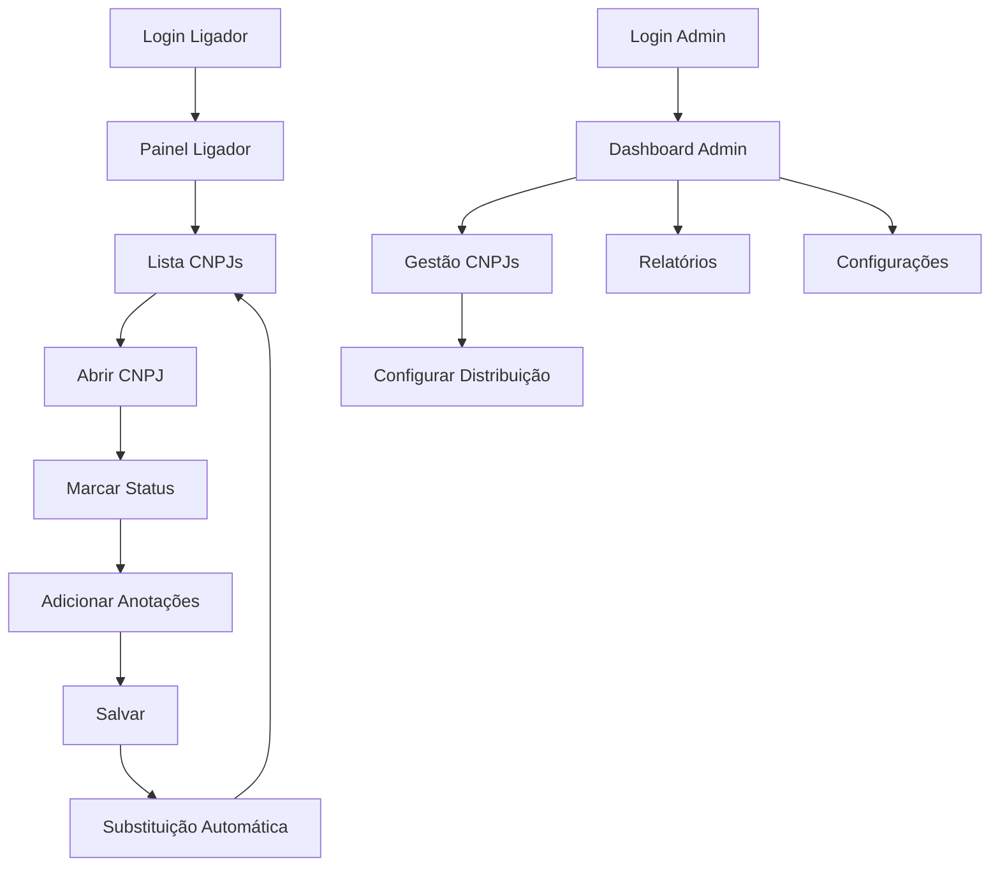

# Sistema de Painel BB PJ - Documento de Requisitos do Produto

## 1. Visão Geral do Produto
Sistema web responsivo para gerenciamento de campanhas de ligações para CNPJs/ONGs do Banco do Brasil, com painel administrativo centralizado e interface dedicada para ligadores.
- Soluciona a distribuição manual e controle de CNPJs entre equipes de ligadores, automatizando o processo e evitando duplicações.
- Destinado a administradores de campanha e equipes de ligadores/atendentes.
- Objetivo: otimizar produtividade das campanhas através de automação inteligente e controle centralizado.

## 2. Funcionalidades Principais

### 2.1 Perfis de Usuário
| Perfil | Método de Cadastro | Permissões Principais |
|--------|-------------------|----------------------|
| Administrador | Cadastro direto no sistema | Gerenciar CNPJs, configurar distribuições, monitorar ligadores |
| Ligador/Atendente | Criado pelo administrador | Visualizar CNPJs atribuídos, marcar status, fazer anotações |

### 2.2 Módulos Funcionais
Nosso sistema BB PJ consiste nas seguintes páginas principais:
1. **Dashboard Administrativo**: painel de controle, estatísticas gerais, gestão de usuários
2. **Gestão de CNPJs**: importação em massa, visualização da base, configurações de distribuição
3. **Painel do Ligador**: lista de CNPJs atribuídos, interface de marcação de status, anotações
4. **Relatórios**: acompanhamento de performance, histórico de ligações, métricas por ligador
5. **Configurações**: parâmetros do sistema, gestão de usuários, configurações de distribuição

### 2.3 Detalhes das Páginas
| Nome da Página | Nome do Módulo | Descrição da Funcionalidade |
|----------------|----------------|-----------------------------|
| Login Admin | Autenticação | Acesso exclusivo para administradores com credenciais específicas |
| Login Ligador | Autenticação | Acesso para ligadores com credenciais individuais |
| Dashboard Admin | Painel Principal | Visualizar estatísticas gerais, CNPJs disponíveis, ligadores ativos, performance geral |
| Gestão CNPJs | Importação | Importar listas de até 10.000 CNPJs via CSV/Excel, validação automática de formato |
| Gestão CNPJs | Distribuição | Configurar quantidade diária por ligador (padrão 200), definir critérios de distribuição |
| Gestão CNPJs | Controle Anti-duplicação | Sistema inteligente que evita envio de CNPJs repetidos entre ligadores |
| Painel Ligador | Lista CNPJs | Exibir CNPJs atribuídos com botão "Abrir" para cada item |
| Painel Ligador | Status Marking | Marcar status: Mordido, Não tem BB, Não atende (+4x), Agendou |
| Painel Ligador | Anotações | Campo de texto livre para observações do ligador com botão salvar |
| Painel Ligador | Substituição Automática | Trocar automaticamente CNPJs marcados por novos disponíveis |
| Relatórios | Performance | Acompanhar produtividade por ligador, status dos CNPJs, conversões |
| Configurações | Usuários | Criar/editar ligadores, definir permissões, resetar senhas |

## 3. Processo Principal

**Fluxo do Administrador:**
1. Login no painel administrativo
2. Importação de lista de CNPJs (até 10.000)
3. Configuração de distribuição diária (200 CNPJs por ligador)
4. Monitoramento de performance e relatórios
5. Gestão de usuários ligadores

**Fluxo do Ligador:**
1. Login no painel do ligador
2. Visualização da lista de CNPJs atribuídos
3. Abertura de detalhes do CNPJ
4. Marcação de status da ligação
5. Adição de anotações
6. Salvamento das informações
7. Sistema substitui automaticamente CNPJs finalizados

## 4. Design da Interface do Usuário

### 4.1 Estilo de Design
- **Cores Primárias**: Azul corporativo (#003366), Amarelo BB (#FFD700)
- **Cores Secundárias**: Cinza claro (#F5F5F5), Branco (#FFFFFF)
- **Estilo de Botões**: Arredondados com sombra sutil, efeito hover
- **Fontes**: Roboto para títulos (16-24px), Open Sans para texto (14-16px)
- **Layout**: Design limpo baseado em cards, navegação lateral fixa
- **Ícones**: Material Design Icons, estilo minimalista

### 4.2 Visão Geral do Design das Páginas
| Nome da Página | Nome do Módulo | Elementos da UI |
|----------------|----------------|----------------|
| Dashboard Admin | Painel Principal | Cards com métricas, gráficos de performance, tabela de ligadores ativos |
| Gestão CNPJs | Lista Principal | Tabela responsiva com paginação, filtros, botões de ação |
| Gestão CNPJs | Importação | Área de drag-and-drop, barra de progresso, validação em tempo real |
| Painel Ligador | Lista CNPJs | Cards expansíveis, botão "Abrir" destacado, indicadores de status |
| Painel Ligador | Detalhes CNPJ | Modal ou seção expansível com radio buttons para status, textarea para anotações |
| Relatórios | Dashboards | Gráficos interativos, filtros de data, exportação de dados |

### 4.3 Responsividade
Sistema desktop-first com adaptação completa para mobile. Interface otimizada para touch em dispositivos móveis, com botões maiores e navegação simplificada. Breakpoints: Desktop (1200px+), Tablet (768px-1199px), Mobile (até 767px).